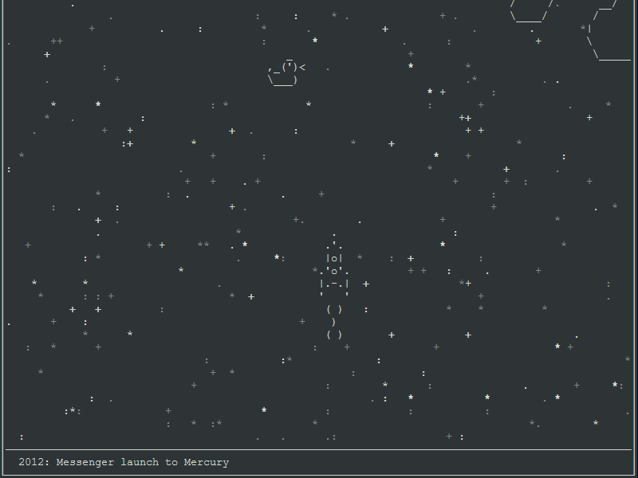

# Борьба с орбитальным мусором

Запуск ракеты для борьбы с мусором на орбите.

### Пример работы



### Как установить

1. Игра использует библиотеку curses, она является стандартной для пакета python, но не для ОС Windows, есть возможность установить ее отдельно, но она не будет работать корректно для этой игры. Вместо этого используйте [WSL](https://docs.microsoft.com/ru-ru/windows/wsl/install-win10).

2. Установите [Python3](https://www.python.org/downloads/) если он ещё не установлен.  

3. Запустить файл `launch_rocket.py`.
```
    python3 launch_rocket.py
```

4. Попытайтесь уклониться от всего мусора (управлеие стрелками) до 2020 года.

### Цель проекта

Код написан для ознакомления с работой асинхронных функций Python на онлайн-курсе для веб-разработчиков [dvmn.org](https://dvmn.org/).
